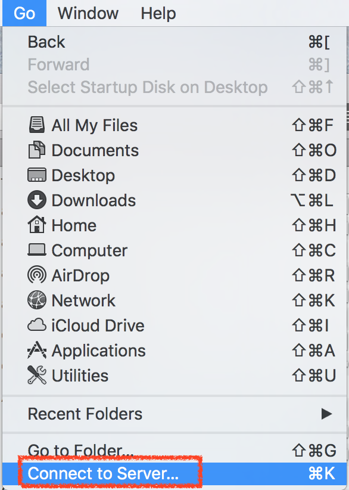

# 連線網路磁碟機

## 打開 Finder

在 `Finder` 上方功能表，點選「前往（Go）」 > 「連接到（Connect to Server）」



## 輸入網路位置連線

在伺服器位址（Server Address）中輸入要連線的網路磁碟機位置，輸入完後點選連線（Connect）就可以直接連線到網路磁碟機了！

```
smb://172.16.1.201
```


## 參考資料
* [如何在 Mac 上透過「檔案共享」進行連線 - Apple 支援](https://support.apple.com/zh-tw/HT204445)