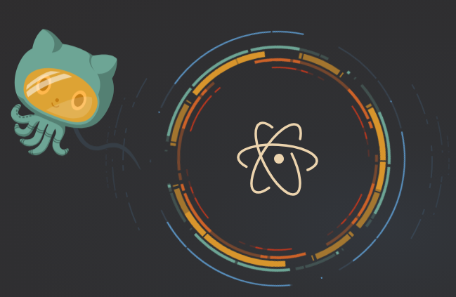

# Atom

Atom 是一個輕量級的編輯器，可以讓你在撰寫程式時更加的方便，也有許多的擴充套件可以安裝，並且支援跨平台的軟體（OS X、Windows、Linux）。

## 下載

* [Atom](https://atom.io/)

## 快捷鍵

### 轉換大小寫

**Windows and Linux**

* 轉換成大寫：Ctrl + K + U
* 轉換成小寫：Ctrl + K + L

**Mac**

* 轉換成大寫：Cmd + K + U
* 轉換成小寫：Cmd + K + L

## 相關網址

* [Atom](https://atom.io/)
